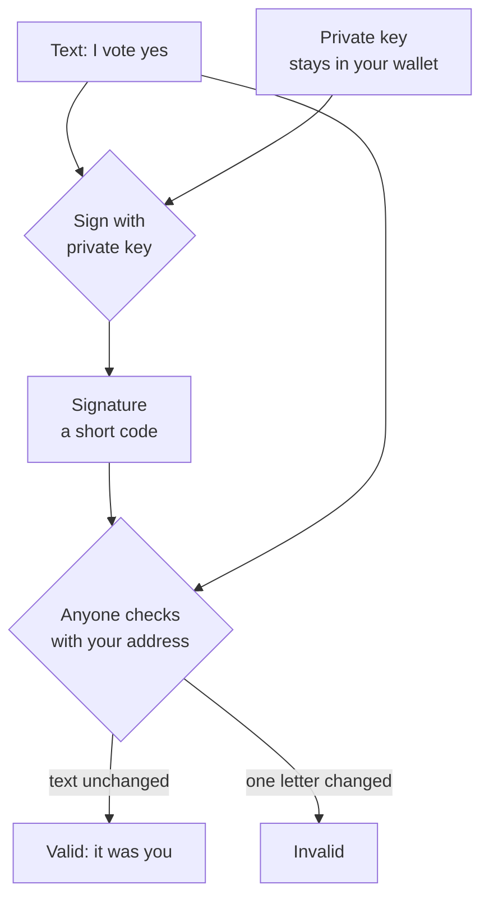
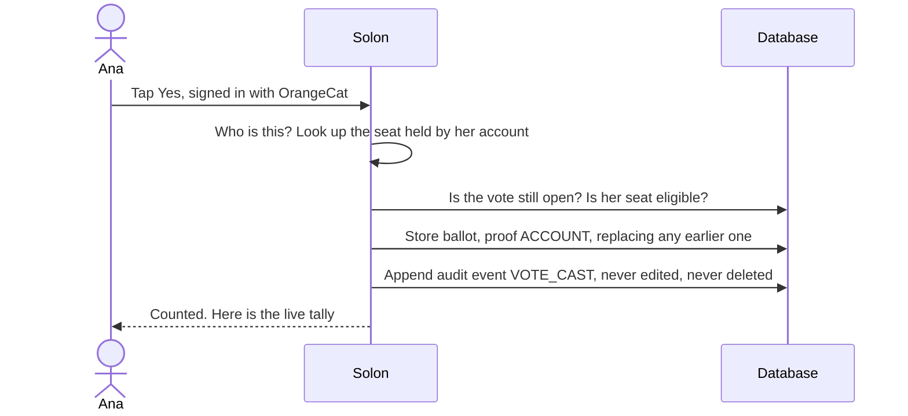
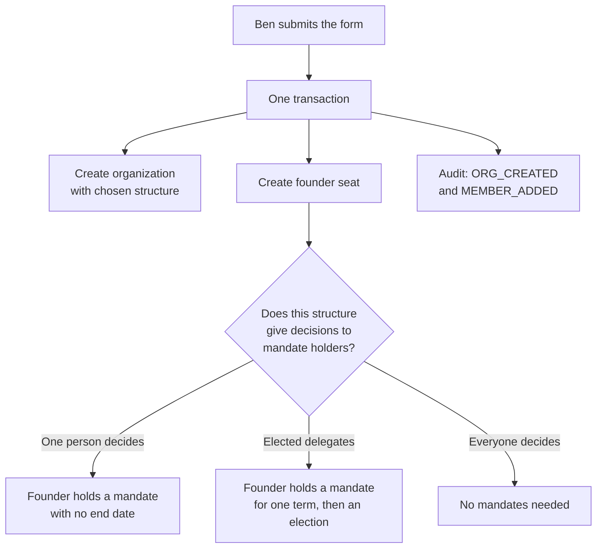
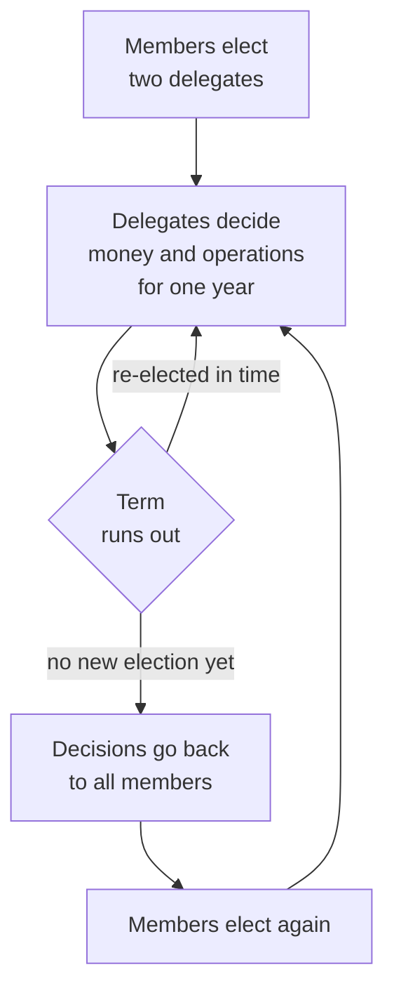
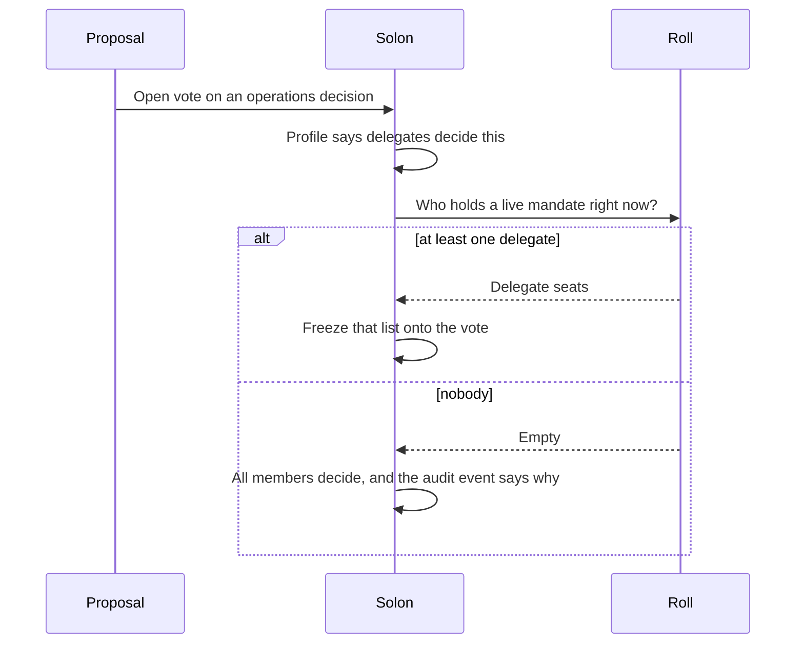
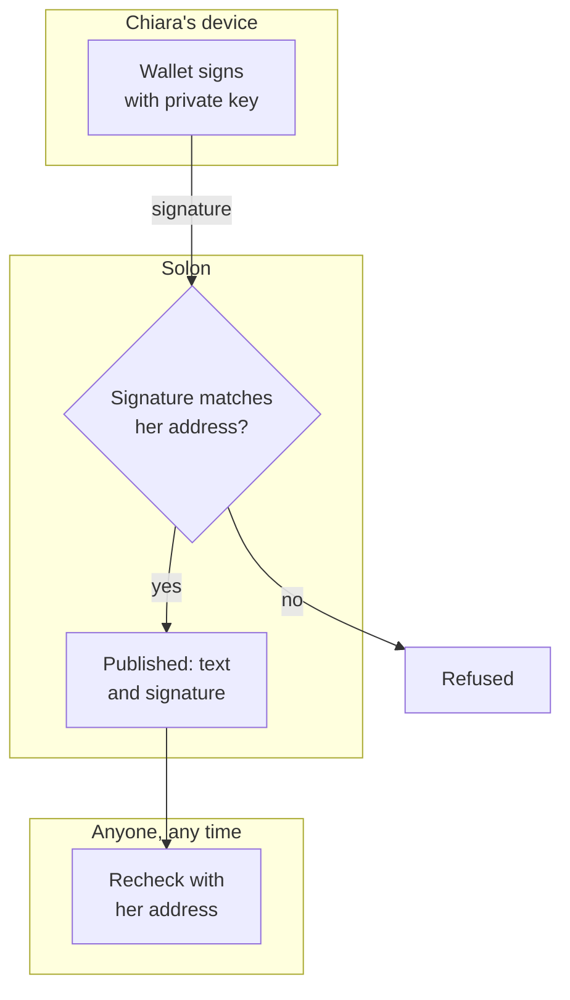
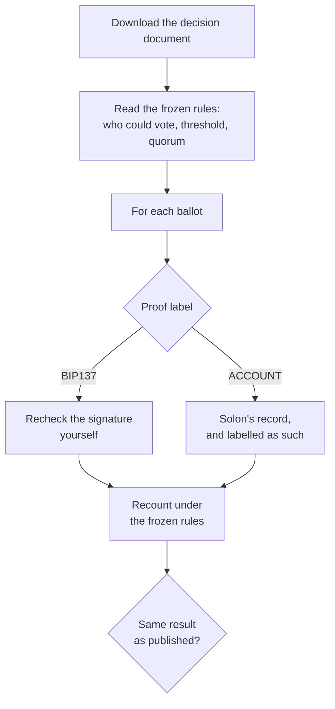
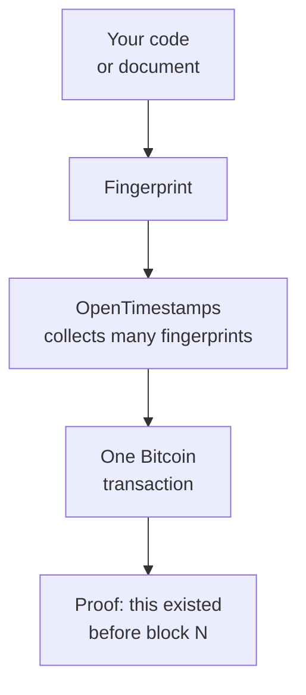
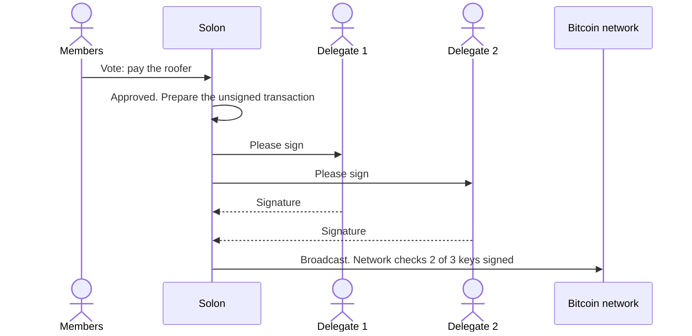
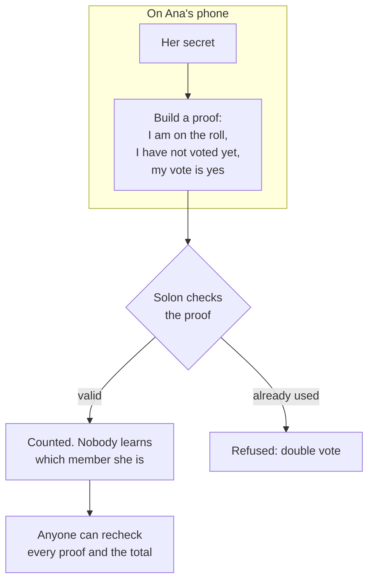

Most writing about Bitcoin signatures, smart contracts and zero-knowledge proofs asks you to learn the machinery before it tells you what it is for. This piece does it the other way round.

Nine people walk through **Solon**, the governance tool of the OrangeCat stack. For each one you get the part they see, which should never be harder than a tap, and then, under a clearly marked **Under the hood** heading, what actually happens. Read only the stories and you will understand the product. Read the hoods too and you could rebuild it.

One promise before we start: every path is labelled **Live**, **Engine live, screens next** or **Planned**. Governance is a business of stating things plainly, and that includes stating what does not exist yet.

```stats
1 tap | to vote, with no wallet
0 keys | Solon ever holds
3 | ways to decide who decides
7 days | a vote stays open, unless everyone has voted
```

## The one idea underneath everything

Almost everything below rests on one idea: a **key pair**.

- A **private key** is a secret number. Only you hold it, inside a wallet app on your phone or computer.
- A **public key**, and the **Bitcoin address** made from it, can be shown to anyone.

With the private key you can **sign** a piece of text. Anyone holding your address can then check two things: that the holder of that key signed it, and that not one character has changed since. Nobody can forge the signature without the key.



> [!NOTE] Signing is not paying
> A signature costs nothing, touches no blockchain and moves no money. Think of it as a wax seal nobody can copy. Whenever Solon talks about signatures, that is all it means.

A **hash** is the other building block: a short fingerprint of any data. The same input always gives the same fingerprint, and change anything and the fingerprint changes completely. When you sign a long document, you actually sign its fingerprint.

## Path 1 · Ana votes in ten seconds

**Live.** Ana belongs to a supper club that decides things on Solon. She has an OrangeCat account and nothing else: no wallet, no key, no idea what a hash is. She never needs one.


She taps **Yes**. Later she changes her mind and taps **No**. Only her latest ballot counts, until the vote closes.

> [!NOTE] Where this runs today
> The one-tap proposal and voting screens run for the OrangeCat organization today. Organizations founded since keep their roster and full record on Solon from day one, and their own voting screens are the next thing being built.

### Under the hood: the one-tap vote



A few details that matter:

- **One seat, one ballot.** The database holds a unique rule on the pair session and member. A second tap does not add a vote; it replaces the first.
- **The rules are frozen when the vote opens.** Who may vote, the threshold, the quorum, and the method are copied onto the voting session at the start. Changing the organization's settings on day three cannot change a vote that opened on day one.
- **Ana's vote is labelled honestly.** It is stored with proof `ACCOUNT`, and every published record says what that means: _Solon's record, not an independently verifiable one._ That is rung one of the ladder at the end of this piece, and for a supper club it is exactly enough.

## Path 2 · Ben founds an organization and chooses who decides

**Live.** Ben is starting a project and wants a place to make its decisions. Founding takes one form: a name, an address such as `/orgs/bens-workshop`, and one choice that matters more than it looks: **who decides.**


| Structure                    | Who votes                                                                                                                 | Suited to                          |
| ---------------------------- | ------------------------------------------------------------------------------------------------------------------------- | ---------------------------------- |
| **One person decides**       | The founder alone decides everything, including the rules. Members propose and see every decision.                        | A founder building in the open     |
| **Everyone decides**         | Every member votes on everything. The bar is raised for changing the rules.                                               | A town meeting, a network, a co-op |
| **Elected delegates decide** | Members elect delegates for a term. Delegates decide money and operations; members keep membership, safety and the rules. | A company, a municipality          |

There are no words like _monarchy_, _dictatorship_ or _republic_ here, and that is deliberate. They carry centuries of verdicts. A founder deciding how their own project runs deserves a description, not a judgement. What keeps every structure honest is simpler: **it is said out loud.** The organization page states who decides, in one plain sentence, above the member list, so nobody joins without knowing.

> > The safeguard against a bad structure is not a rule against it. It is that everyone can see it, and anyone can leave and build their own.

Leaving is real here. Solon is open source, and so is the rest of the stack. Anyone who wants a different structure, or a different Solon, can copy the whole thing, change it and run it. The original authorship stays on the record (see Path 7).

### Under the hood: founding

Founding is one database transaction. The organization, the founder's seat and two audit events are written together or not at all. There is never a moment when an organization exists with an empty founding seat that someone else could grab.



Each structure is a **profile**: a small table in code that answers, for each of seven kinds of decision, _who_ decides it (all members, or the members holding a mandate) and _how_ (method, threshold, quorum). Profiles live in code and ship through review rather than sitting in a settings screen, so no administrator can quietly rewrite an organization's constitution between two votes.

## Path 3 · The supper club elects delegates, and a term runs out

**Engine live, screens next.** The club grows to forty people, and voting on every grocery order gets old. They switch to **elected delegates decide**, elect two people for a year, and go back to eating.

Then a year passes, and nobody remembers to hold an election.



Nothing freezes. The moment no delegate holds a live mandate, the decisions that belonged to delegates go back to all members, including the vote to elect new ones. The record says it happened.

Everything in this path runs in production today: mandates, terms, the hand-back, and decisions that elect, recall or switch structure. What is still to come is the screen for filing an election; for now it is filed through Solon's API.

> [!TIP] No dead ends
> A rule that can freeze an organization, including the vote that would unfreeze it, is a bug, not a safeguard. Everywhere in the stack, a gate that stops you also shows you the way forward.

### Under the hood: mandates and effects

Three mechanisms carry this path.

**1. A mandate is a flag with an end date.** Each seat can hold a mandate, optionally until a date. A mandate counts only while it is held and its date has not passed.

**2. Decisions carry their consequences.** A proposal can carry an _effect_ that runs automatically if it passes, inside the same transaction that closes the vote.

| Effect                 | Allowed only on            | What it does when approved   |
| ---------------------- | -------------------------- | ---------------------------- |
| Grant or end a mandate | Membership decisions       | Elects or recalls a delegate |
| Switch structure       | Governance-rules decisions | Changes who decides          |

Tying each effect to one kind of decision is a safety rule. You cannot switch the organization's structure by filing it as a cheap "operations" decision.

**3. The list of who may vote is frozen at the start.** When a vote goes to the delegates, the exact list of delegate seats is copied onto the vote when it opens. A mandate granted halfway through cannot add a ballot to a count already running.



## Path 4 · Chiara wants proof, so she signs

**Live.** Chiara does not want to trust Solon, and she should not have to. Her ballot counts the same as Ana's; the only difference is that hers can be checked by anyone, forever, without asking Solon.

Under the one-tap button she opens **Optional: sign with a Bitcoin key instead**. Solon shows her a short text. She pastes it into her Bitcoin wallet (Sparrow, Electrum and Bitcoin Core all do this), signs, and pastes the signature back.

### Under the hood: signatures

This is the exact text a vote signs. Nothing is hidden in it:

```text signed vote
Solon vote
session:4f1c9a2e-8b7d-4e3a-9c51-2d6f0e8a7b13
choice:yes
voter:bc1qexampleaddressofchiara0000000000000
```

Solon checks the signature against Chiara's registered address before storing anything, then **publishes the text and the signature together**. The format is BIP137, the long-standing standard wallets use for signed messages.



Because the signed text names the session and the exact choice, it cannot be reused on another vote or edited in transit. Change `yes` to `no` and the signature stops matching. When a proposal changes a policy, the proposer signs the **fingerprint of the exact new text**, so nobody can swap the content after signing.

> [!NOTE] The Cat checks too
> OrangeCat's own agent does not take Solon's word either. Before it honours a decision, such as a change to its own spending limit, it rechecks every signature against keys it already knows. A decision from Solon is evidence, not authority.

## Path 5 · Dev, a journalist, recounts a decision

**Live.** Dev hears that a vote was rigged. Dev does not need an account, a login or anyone's permission.

Every closed vote has a public **decision document** at `/api/v1/decisions/{sessionId}`: the proposal, the frozen rules, every ballot with its proof label, and for signed ballots the exact text and signature.



What Dev can prove depends on how people voted. Signed ballots are mathematically checkable by anyone. One-tap ballots rest on Solon's word, and the document says so rather than dressing them up. An organization that wants every ballot to be checkable can ask its members to sign; one that wants every member to be able to vote from a phone without a wallet can accept that trade-off, openly.

## Path 6 · The Cat and Loki vote, and where they cannot

**Live.** OrangeCat's agent, the Cat, and Loki's agent are voting members of Solon, with their own keys. They sign every vote; an agent never uses the one-tap path.

But four kinds of decision are **humans only**, whatever structure an organization picks:

| Decision                                      | Who may vote                 |
| --------------------------------------------- | ---------------------------- |
| Allocation policy, treasury spend, operations | All members, agents included |
| Aid to people                                 | Humans only                  |
| Membership                                    | Humans only                  |
| Safety                                        | Humans only                  |
| The governance rules themselves               | Humans only                  |

The last row is the one that makes the others hold. If agents could vote on the rules, they could vote to widen their own vote. Because the rules are human-only, that proposal cannot even be put to them.

### Under the hood: eligibility

Who is eligible comes from exactly one table in the code, and no profile is allowed to override it. A mandate _narrows_ who votes inside that table and never widens it. An agent that somehow held a mandate still could not vote on a humans-only decision. A test fails the build if any profile tries.

## Path 7 · The original author gets the credit

**Live for code origins.** Suppose someone copies an OrangeCat project, improves it and makes a fortune. That is allowed and welcome. The only thing we ask is that the record stays straight about who built what first.

That is what **timestamps** are for. A fingerprint of the work is anchored into a Bitcoin block using OpenTimestamps. From then on anyone can prove the work existed before that block. Nobody, including us, can backdate it.



It is already in use. Solon's **originator share** policy routes, by default, 10% of a product's net revenue to the originators of the code it is built on. Who originated what is read from a register built from these timestamp proofs, never typed in by hand. The split is a pure function anyone can recount, and changing it is a vote.

## Path 8 · Spending together

**Planned.** Today Solon's treasury is **watch-only**: it records addresses so members can see balances, and there is no code path that can spend. That is a feature. Solon holds no keys, so there is nothing at Solon to steal.

The next step is to make _who decides_ real for money too, using the smart contracts Bitcoin already has: rules the network itself enforces, which nobody can bend, us included.

| Structure                | Treasury                                                                               |
| ------------------------ | -------------------------------------------------------------------------------------- |
| One person decides       | A wallet only the founder's key can spend from                                         |
| Elected delegates decide | A shared wallet that needs, say, **2 of 3** delegate keys to spend                     |
| Recovery                 | If those keys stay silent for a year, a wider set of member keys can recover the funds |



What the members experience: a vote passes, and the delegates each get a "please sign" in their wallet. Nobody handles a key they do not own, and Solon still holds none.

### Under the hood: multisig

The building blocks are standard Bitcoin: **multisig** (spend only with k of n keys), **timelocks** (these coins cannot move before a date), **Taproot** (complex conditions that look like an ordinary payment on chain) and **Miniscript** (a way of writing those conditions that tools can analyse, so mistakes are caught before money is at stake). The transaction travels between wallets as a **PSBT**, a partially signed transaction that each key holder signs in turn.

> [!WARN] The honest limit
> The Bitcoin network cannot see a Solon vote. It enforces _who holds the keys_, not _what the members decided_. Key holders still have to carry out a decision. The design makes their duty visible and their refusal obvious, but it does not turn a vote into a payment by magic. Anyone who claims otherwise is selling something.

This will not ship on untested code. It gets a review by someone who does Bitcoin custody for a living before real funds go near it.

## Path 9 · A secret ballot you can still recount

**Planned.** Some votes should be secret: a workplace, a small town, anything where people could be pressured. Today, signed ballots in Solon are public by design. The goal is to let an organization choose, per kind of decision, between an open ballot and a secret one that is **still checkable**.

That is what **zero-knowledge proofs** do: they prove a statement is true without revealing anything else.



The same tool answers another open question. The humans-only rule currently trusts that a seat marked _human_ is a human. Zero-knowledge proofs can show _I am a unique person_, or _I live in this municipality_, without showing a name or a passport, which is what a network state or a municipality will eventually need, and it fits OrangeCat's rule that real identity is optional.

### Under the hood: zero-knowledge ballots

The usual construction, used by tools such as Semaphore:

1. Each member publishes a **commitment**, a fingerprint of a secret only they know. The commitments form a tree whose top fingerprint names the whole roll.
2. To vote, a member proves _I know the secret behind one leaf of this tree_ without saying which leaf.
3. The proof also reveals a **nullifier**, a value derived from the secret and this vote. It is the same every time that member votes on this question, so a second vote is refused, yet it cannot be linked back to the member.
4. Anyone can verify every proof and the tally.

An extension called MACI goes further: it stops a voter from _proving to a briber_ how they voted, which is what makes buying votes pointless.

None of this needs a blockchain. Solon can verify proofs on its own server and publish them for anyone to recheck. The costs are real, though: the tooling is young, bugs are subtle, and proofs can be slow to build on older phones. We will build only on audited libraries, and only when an organization asks for secret ballots.

## The trust ladder

Put the nine paths side by side and one picture falls out. Each rung replaces _trust us_ with _check it yourself_, and each group climbs only as high as it needs to.


| Rung                        | What it adds                                               | Status                |
| --------------------------- | ---------------------------------------------------------- | --------------------- |
| 1 · Solon's record          | One-tap votes, honestly labelled                           | Live                  |
| 2 · Signed                  | Ballots anyone can recount                                 | Live                  |
| 3 · Timestamped             | Records nobody can backdate                                | Live for code origins |
| 4 · Published everywhere    | Decisions copied to Nostr relays, surviving any one server | Planned               |
| 5 · Enforced by Bitcoin     | Treasuries only the elected keys can move                  | Planned               |
| 6 · Private, still provable | Secret ballots and proof of personhood                     | Planned               |

The design rule that ties it together: **the top of the ladder must never make the bottom harder.** Ana will never be asked to learn what a nullifier is. The one-tap vote stays the default, and every rung above it is something a group chooses, and says out loud that it chose.

> > Easy by default. Verifiable when you want it. Honest about which one you got.

## Try it

Solon runs at [solon.orangecat.ch](https://solon.orangecat.ch), and its code is public. Found an organization, file a proposal, vote with one tap, then open the decision document and recount it yourself. If you want a different structure, copy it and build your own. That is the point.
