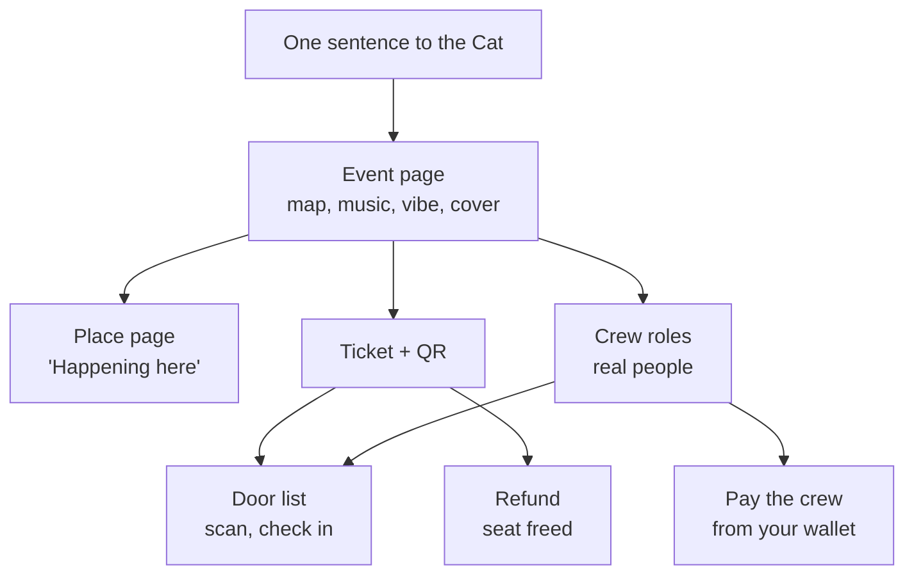

The test was one sentence: "electronic music night at Espresso Bar in Landquart on Friday." Could OrangeCat take that and carry the night — the page, the map, the tickets, the door, the people working it, and their pay?

It could not. So we ran it for real — a database rebuilt from every migration production has run, the app in a browser — as four people (an organizer, a guest, a door person, a DJ) on a phone-sized screen, and wrote down every place it broke.

## What a night needs, and where each part lives

Each box is a thing you can do today. Each arrow was, at some point this week, broken.

## What testing found

Nine defects, none of which any unit test had caught, because each one lived between two parts that were each fine on their own. These are the six a person would have met:

| What looked fine                 | What actually happened                                                                                           |
| -------------------------------- | ---------------------------------------------------------------------------------------------------------------- |
| The Cat creates an event         | It wrote the place into a field events do not have. Every event it made failed.                                  |
| A published event page           | It only showed listings marked "active", a status events never have. Everyone but the organizer got "not found". |
| "Near me"                        | The site told browsers not to share location with itself. It could never work.                                   |
| Friday at 22:00                  | Shown as 8:00 PM, in the server's time zone, and the Cat stored "10pm" as 10pm in UTC.                           |
| Booking and review notifications | The database's list of allowed kinds had drifted from the app's. They were refused and only logged.              |
| A place for events               | Two different models existed for it, one on each side of a merge.                                                |

The time zone one is the instructive kind. Nothing crashed. A Landquart night simply moved two hours, on every page, for everyone, and every test passed because every test ran in UTC.

## What works now

- **One sentence.** "Electronic music night at Espresso Bar on Friday at 10, techno and house, I need a DJ, two bartenders and someone on the door, 15 CHF." After you confirm, the Cat makes the event: on the map, music and vibe on the page, priced in your currency, crew posted as open roles.
- **The place.** The bar gets its own page, and its events show under "Happening here". If it is not your bar, name the owner; the page waits for them to claim it while you look after it. Only whoever runs a place can list events there.
- **Time.** A 22:00 night reads 22:00 everywhere, because times are read and written in the venue's zone, worked out from its address.
- **Tickets.** A QR code on the event page, a notification with the link, a free "Get a ticket" button, and a full event stops selling before anyone pays.
- **The door.** Scan the QR with any phone camera and the door page says, in one glance: in, already in, or not a ticket for this event. Whoever holds the Door role can do this from their own phone, not the organizer's.
- **The crew.** Put people on roles by username. They are told, and see "You're on the crew."
- **Money out.** Next to each person, "Pay" sends their fee in Bitcoin from your own connected wallet, or records that you paid them another way, because a lot of crews are paid in Twint and cash, and a record that pretends otherwise is wrong. Refunds work the same two ways from the door list. Nobody is paid twice for a role, and a send that fails is recorded as failed.
- **The cover.** Send the Cat a photo, or ask it to make one with your own AI key. Every picture field on OrangeCat can now also find an openly licensed photo.

OrangeCat still holds no money. Every payout leaves the organizer's own wallet through the same path as the Send screen; the event keeps the record of who was paid what.

## What is not built

- **Paid tickets need an account.** The ticket has to live somewhere, and paying without one needs the rails above. Free tickets no longer do: since the evening this was written, a guest gives their name and the ticket's own page is the ticket.
- **No Twint, bank or PayPal checkout.** Those need business accounts, identity checks and reconciliation. Until then, "paid another way" records it honestly instead of faking a rail.
- **Generating a cover needs your own image key.** The platform does not pay for pixels. Without one, the Cat makes the event and tells you where to add a picture.
- **The Cat was tested handler by handler, not against the live model.** That check happens on production after the deploy.

## The record points both ways now

The [roadmap](/roadmap) has an "Events, end to end" goal with a step for each item above. Each step now links to the day in the [changelog](/changelog) that delivered it, and each changelog line names the step it was for.

The link is one token in the markdown, `{#event-payouts}` on the roadmap step and the same token on the changelog line. It lives in the fleet's shared building-in-public kit, so every product's roadmap can carry it, not just this one. A test fails if the changelog cites a step the roadmap does not have.

A plan you cannot trace to what shipped is a wish list. Now each step says where it shipped.
