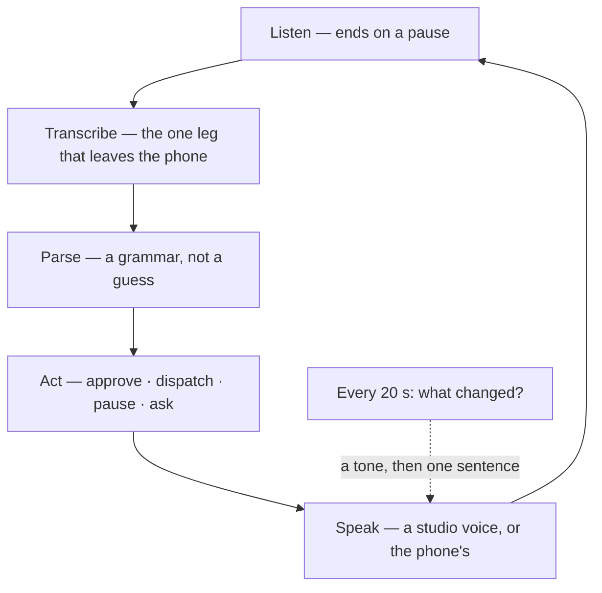

Every surface in the OrangeCat stack assumes a screen. The Cat assumes a chat window, Loki assumes a dashboard, Solon assumes a ballot. This week the founder's computer broke, the phone became the only screen, and the brief, dictated into it, was short: _I don't want to look at it. I want to hear the fleet in the headphones, say what I want into the microphone, and still have total control._

Loki shipped that today. It is called no-screen mode and it lives at [loki.orangecat.ch/voice](https://loki.orangecat.ch/voice). This is what it is like, what makes it bearable to listen to, and where it stops.

```stats
1 tap | then the phone goes in your pocket
13 | commands; everything else is a question for Loki
20 s | between a run finishing and you hearing it
0 | new ways to approve, dispatch or pause — it reuses the screen's
```

## What it is like

Headphones in. Press Start, once. A quiet bed of slow chords begins, and a voice reads the briefing: who is working and for how long, what is waiting for a builder, what is waiting on you, what failed. Then the phone goes in the pocket and you go for the walk.

Twenty minutes later, two rising notes, and the voice: _Done on heidi: the header fits at 320 pixels._ A knock, two equal notes: _New approval: reply to the visitor who reported the broken header. Say approve or reject._ You say "approve." _Approved._ You say "tell orangecat to run the tests and fix what fails." _Sent to orangecat. I'll tell you when it finishes._

Then nothing for ten minutes, and that is fine, because the music is still playing, so you know the line is still open.

## What makes it bearable

A voice is a slow channel: about 150 words a minute, no skimming. An AI voice that talks too much is the fastest way to make someone take the headphones out, and the first version did exactly that. Four things fixed it.

- **A voice you can live with.** Signed in, Loki reads with a studio voice, one of six, in pieces short enough to sound like speech. No voice on the box, or no signal? The phone's own voice takes over mid-sentence.
- **Music the phone makes itself.** Slow chords, composed on the phone as you listen. No file, no licence, no stream. It drops under the voice and comes back after. When the line really drops, you hear two low falling notes and _I lost the connection._
- **A tone before the news.** Rising notes for finished, falling for failed, a knock for something that needs you. Under half a second each, so you know what is coming before the first word.
- **Fewer, better sentences.** Three runs finishing in a minute are one sentence, not three. The same news never comes in the same words twice in a row. What needs you comes first. One switch holds the "finished" news and reads it as a single sentence every five minutes. "Details" reads what each run did, only when you ask.

And you can talk over it: say anything while Loki is speaking and it stops and listens.

## What you can say

| You say                                                 | What happens                                        |
| ------------------------------------------------------- | --------------------------------------------------- |
| Status                                                  | The briefing                                        |
| What's waiting on me                                    | The approval queue, numbered                        |
| Approve the first one · Reject number two · Approve all | The same decision the Approvals page makes          |
| Tell heidi to fix the header                            | A run starts on that project; you hear when it ends |
| What failed                                             | Today's errored runs, with the error                |
| Pause everything · Resume heidi                         | Autopilot off or on, fleet or project               |
| Details · Say that again · Quiet · End                  | Handled on the phone                                |
| Anything else                                           | Loki answers as in chat, read aloud                 |



```deep Under the hood: why the commands are a grammar, not a model
The obvious build is to hand every sentence to a model and let it decide whether "approve" meant approve. On a screen that is fine: the action lands in a confirmation dialog. With no screen there is no dialog, so Loki's parser is a grammar over a normalised sentence, with project names matched the way people say them ("orange cat" finds `orangecat`; "going" does not find `go`).

A bare "yes" is not an approval; "yes, approve the second one" is. A bare "stop" means be quiet, never stop the fleet. A sentence that names no registered project is a question, however imperative it sounds.

The vocabulary is one list in the code, read by the parser, by the spoken "what can I say" answer, and by the public page. A test feeds every phrase the page promises into the parser. A promise the parser does not keep cannot ship, which matters more than usual when the person who would notice has their eyes shut. Every action reuses the function the screen uses — the Approvals page's decision, the composer's send, Control's pause button — so the page and the headphones cannot disagree.
```

```deep Under the hood: the sound
Everything that is not words goes through one audio graph on the phone, and one stream out of it is what the phone plays, so the whole thing counts as a track: lock-screen title, the headphone button as play/pause, playback that continues with the screen off wherever the platform allows a track to.

The tones are a few MIDI notes each: C5–E5–G5 rising for finished, G4 falling to E♭4 for failed, E5 twice for something that needs you. None lasts longer than 0.6 seconds. The music is six chords in D, each held 18 seconds, every note two oscillators detuned five cents apart through a slowly drifting low-pass filter and a feedback delay, with nothing above F♯4 so it sits under the band where speech lives. It plays at 0.09 at rest and 0.025 under the voice.

The studio voice is Groq's Orpheus endpoint, about a cent for an hour of briefings. It likes about 200 characters a request, so a briefing is cut at sentence ends and fetched one piece ahead of the one playing. Any failure hands the rest to the phone's own voice and stops asking for two minutes. Talk-over watches the microphone while Loki speaks: a burst well above the room's level for a third of a second is a person; the voice stops.

The full design, with the seam map and the one change to the voice loop, is in Loki's own essay: [The Fleet in Your Ear](https://loki.orangecat.ch/thoughts/the-fleet-in-your-ear).
```

## What it means for the Cat

OrangeCat's first principle is that the Cat is the interface: an AI agent working on behalf of a person, and the entities are the world it reads. Loki is the execution plane of those entities, and no-screen mode is the first surface in the stack where an agent's whole job can be steered with no visual interface at all.

That is the pattern we want for the Cat too. An economic agent that can only be used by looking at it is an agent for people with a free screen and a free hour. The person running a café, a workshop or a fleet of agents has neither. The mechanism Loki built — a briefing composed from records, a small explicit grammar for the actions that move money or work, a tone and one sentence for what changed, and enough care in the sound that you can leave it on — is the same shape the Cat needs for funding, lending and governance. Loki went first because its records were already the richest, and because its operator needed it this week.

## Where it stops

- **A locked iPhone in a pocket for an hour.** The loop has been run in a desktop browser with a synthetic microphone; the pure parts have 60 unit checks. The music and voice now travel as one media track, which is how platforms keep audio alive with the screen off; whether the microphone stays open beside it on a locked iPhone is the test that matters, and it has not been run. The page says so until it passes.
- **Your words leave the phone once; Loki's leave it once.** Speech goes to the transcriber and is discarded there. With the studio voice on, Loki's answers go out once to be spoken; with the phone's voice, nothing of Loki's leaves.
- **The PIN holds.** Approvals behind Loki's private-zone PIN are not read aloud until you unlock them on screen. A mode built to need no screen still needs it once, for the thing a screen was guarding.

The mode is at [loki.orangecat.ch/no-screen](https://loki.orangecat.ch/no-screen), with a twenty-second sample you can hear before signing in.

A dashboard asks you to look. A fleet you can hear asks nothing until something needs you.
