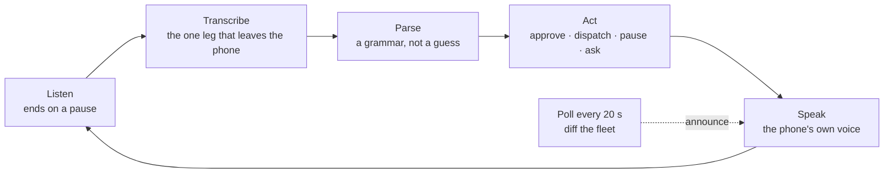

Every surface in the OrangeCat stack assumes a screen. The Cat assumes a chat window, Loki assumes a dashboard, Solon assumes a ballot. This week the founder's computer broke, the phone became the only screen, and the brief, dictated into it, was short: *I don't want to look at it. I want to hear the fleet in the headphones, say what I want into the microphone, and still have total control.*

Loki shipped that today. It is called no-screen mode, it lives at [loki.orangecat.ch/voice](https://loki.orangecat.ch/voice), and this post is what it does, why it is built the way it is, and where it stops.

```stats
1 tap | then the phone goes in your pocket
12 | commands; everything else is a question for Loki
20 s | between a run finishing and you hearing it
0 | new ways to approve, dispatch or pause — it reuses the screen's
```

## What you hear

Press Start once and the first thing in your ear is the briefing: who is working and for how long, what is waiting for a builder, what is waiting on you, what failed. Every sentence is composed from one snapshot of the same tables Loki's Control page reads, by a function with a test around it. It leads with what needs you. It never lists idle projects. When there is nothing, it says so, because with your eyes closed silence sounds exactly like a dead microphone.

Then you talk, and the twelve commands do what the screen does:

| You say | What happens |
| --- | --- |
| Status | The briefing |
| What's waiting on me | The approval queue, numbered |
| Approve the first one · Reject number two · Approve all | The same decision the Approvals page makes |
| Tell heidi to fix the header | A run starts on that project; you hear when it ends |
| What failed | Today's errored runs, with the error |
| Pause everything · Resume heidi | Autopilot off or on, fleet or project |
| Say that again · Quiet · End | Handled on the phone |
| Anything else | Loki answers as in chat, read aloud |

The part that is not a chat is what happens between turns. Every twenty seconds the phone asks Loki what changed and reads the difference into your ear without being asked: a run finished and what it did, a run failed and why, a new approval, the builder dropping offline or coming back. A chat waits for you. A fleet does not.



## Why the grammar is explicit

The obvious build is to hand every sentence to a model and let it decide whether "approve" meant approve. On a screen that is fine: the action lands in a confirmation dialog. With no screen there is no dialog, so Loki's parser is a grammar. A bare "yes" is not an approval; "yes, approve the second one" is. A bare "stop" means be quiet, never stop the fleet. A sentence that names no registered project is a question, however imperative it sounds.

The vocabulary is one list in the code, read by the parser, by the spoken "what can I say" answer, and by the public page. The test feeds every phrase the page promises into the parser. A promise the parser does not keep cannot ship, which matters more than usual when the person who would notice has their eyes shut.

## What it means for the Cat

OrangeCat's first principle is that the Cat is the interface: an AI agent working on behalf of a person, and the entities are the world it reads. Loki is the execution plane of those entities, and no-screen mode is the first surface in the stack where an agent's whole job can be steered with no visual interface at all.

That is the pattern we want for the Cat too. An economic agent that can only be used by looking at it is an agent for people with a free screen and a free hour. The person running a café, a workshop or a fleet of agents has neither. The mechanism Loki built, a briefing composed from records, a small explicit grammar for the actions that move money or work, unasked announcements for what changed, is the same shape the Cat needs for funding, lending and governance. Loki went first because its records were already the richest, and because its operator needed it this week.

## Where it stops

Three limits, stated on the page as well as here.

- **It is a web page.** The microphone, the voice and the headphone button are the browser's. The loop has been run in a desktop browser with a synthetic microphone, and the two pure halves have 40 unit checks. A locked iPhone in a pocket for an hour is the test that matters, and it has not been run yet. The page says so until it passes.
- **Your words leave the phone once.** Speech goes to the transcriber and is discarded there. Answers are spoken by the phone itself.
- **The PIN holds.** Approvals behind Loki's private-zone PIN are not read aloud until you unlock them on screen. A mode built to need no screen still needs it once, for the thing a screen was guarding.

The full design, with the seam map and the one change to the voice loop, is in Loki's own essay: [The Fleet in Your Ear](https://loki.orangecat.ch/thoughts/the-fleet-in-your-ear). The mode is at [loki.orangecat.ch/no-screen](https://loki.orangecat.ch/no-screen).

A dashboard asks you to look. A fleet you can hear asks nothing until something needs you.
