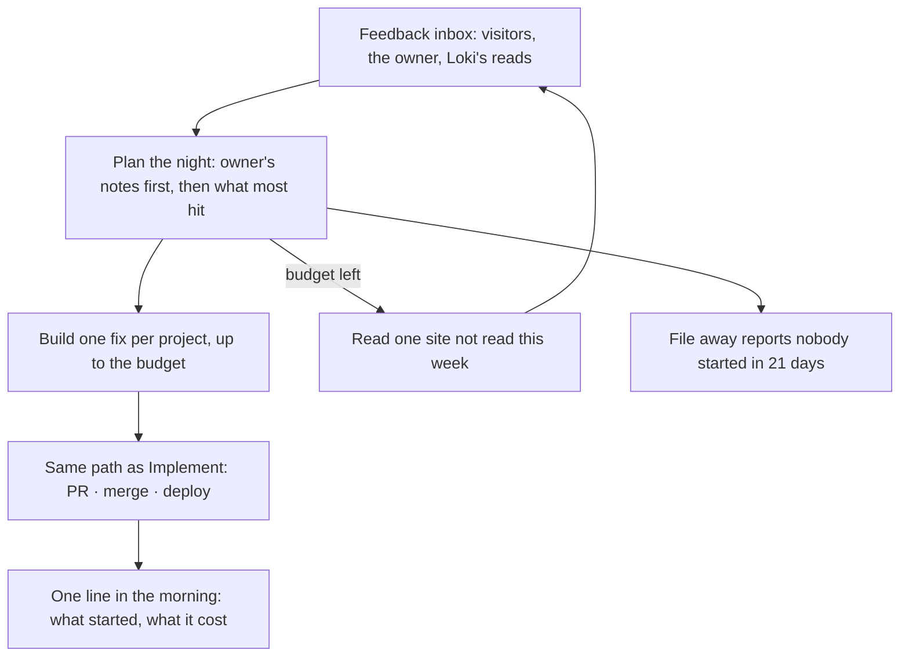

Every builder on this platform has the same night. The laptop closes, the sites stay up, and somewhere a queue of things that could be better sits untouched until morning. The promise of an agent fleet is that the queue does not have to wait. The risk is that the fleet spends the night, and the owner's credits, on work nobody wanted.

For months Loki's night was a guess. At four in the morning a timer woke up to three idle projects and handed each one the same instruction: pick the highest-impact action and do it. Some nights that produced a real improvement. More often it produced a pull request about something the owner had not thought about, a queue entry that stayed open for weeks, and a morning spent clearing out what the owner called, accurately, garbage. A run with no brief is a run that invents its own.

## What the night does now

The night works from the one place where the brief already exists: the feedback inbox. Every site with Loki's widget collects what visitors say, what the owner says while using their own site, and what Loki's own read of each page finds. Each of those is a specific ask, in someone's words, about a page that exists.

So the night starts there. It takes the open reports, puts the owner's own notes first, then whatever the most visitors hit, and builds one fix per project through exactly the same path as the Implement button: the same prompt, the same pull request, the same automatic merge and deploy, the same "Live — check it" waiting in the morning. A night's run is a person's run that happened to start at half past two.

When there is budget left after the fixes, it reads one site that has not been read this week, as a first-time visitor on a phone, and files what it finds into the same inbox for a later night. And it files away any report nobody started in three weeks, with the reason written on the row and one tap to bring it back.



## Why the unit is a run

The obvious limit is money: spend no more than this many francs a night. We did not build that, and the reason is worth saying.

A run is what spends the owner's agent credits. Some runners report what a run cost; some do not — an agent on a subscription reports nothing, because nothing was metered. A money cap can only count the runs that report, which means the cap is only as real as the least honest runner. A cap on runs holds whether or not anyone reports a price.

So the setting is "up to N runs a night", default four, ceiling twenty, and zero means the night still files away and unsticks but builds nothing. Where a price is known it is shown afterwards, on the morning line, next to the count. The count is the gate; the price is the receipt.

|                 | The old night                                    | The new night                                                                       |
| --------------- | ------------------------------------------------ | ----------------------------------------------------------------------------------- |
| Starts from     | A generic "pick the best action" prompt          | Open reports, in the words of whoever filed them                                    |
| Limit           | Three projects a tick, no cap on what that spent | A number of runs the owner sets                                                     |
| Guesses         | Every run                                        | None — no report, no run                                                            |
| Reads the sites | Never                                            | One a week, each                                                                    |
| Old reports     | Stayed open forever                              | Filed away after 21 days, reason on the row, one tap back                           |
| The morning     | Nothing                                          | One line: what started, what was read, what was filed, runs used, spend where known |

## The one rule the night does not break

A timer on the box may not call a model on the shared free tier. That rule exists because a scheduled job spends with nobody asking, and a free pool shared by every app is the easiest thing in the world to drain at four in the morning. It is enforced by a test that walks every scheduled route and fails if one can reach a model.

The night stays inside it. A fix is an agent run on the owner's own builder. A read is an agent run that files its findings through the widget's public API. The morning line is assembled from counts. Nothing on the timer thinks; it only decides who gets to.

```deep Under the hood: the planner
The decisions are one pure function, `planNight`, in Loki's `src/config/autopilot-night.ts`, with the facts gathered around it in `src/lib/autopilot-night.ts`. It takes the budget, the projects (paused, runnable, readable, last read, busy) and the open reports, and returns a plan: which reports to file away, which to build and in what order, which site to read, and why each skipped candidate was skipped. Priority is the owner's own notes, then reports by how many visitors hit the same thing, then the newest. One lane per project. A read only after the fixes, only on a site not read in seven days, and only one per night, because a read files findings that later nights will spend runs on.

The same dispatch gates Control uses refuse a project whose agent reported `working` or `blocked`, one stuck in a no-op loop, one on a failure streak, or one the owner paused. The test file pins the budget as a hard cap, the one-lane rule, the stale-report rule, the read coming after the fixes, and the morning line being one sentence or nothing.
```

```deep Under the hood: what a night leaves behind
One row per account per night in `autopilot_nights`: the budget, each fix with its report and run, each read with its run, how many reports were filed away, how many stuck rows were handed to the cloud builder, and the skip counts. The morning line on `/feedback` is derived from that row plus the cost each run reported, if any. The same line goes to the owner's Telegram and to push. A night that did nothing writes the row and sends nothing — silence when fine.

The old idle nudge is retired, not paused: its route is gone and its timer is replaced in the installer. Rows nobody started in 21 days are archived with `archive_reason` set, which the row shows and which a reopen clears.
```

## What the first nights have to prove

Three things, and none of them are proven yet.

That four runs a night is the right default. It is in line with what the old night spent, but the old night was spending on guesses, and a run with a brief behind it may be worth more or less. The number is a setting because it was never going to be right the first time.

That the reads are worth their findings. A read files up to eight things, and later nights will build them. If the reads are shallow, the night will be busy and the sites will not be better. The read is held to the same rule as everything else Loki says unasked: at most three findings, each quoting the page, or nothing.

That filing away after three weeks is kind rather than careless. A report nobody started in 21 days is, on the evidence so far, a report nobody wanted. But the evidence so far is one owner's inbox. The reason stays on the row and reopening is one tap, so the cost of being wrong is a tap.

The companion piece on Loki, [Loki Reads the Page](https://loki.orangecat.ch/thoughts/loki-reads-the-page), is about the read itself: why a ruler could not see what a visitor sees, and what the reader still cannot.

A team that works while you sleep is only a gift if you set its hours.
