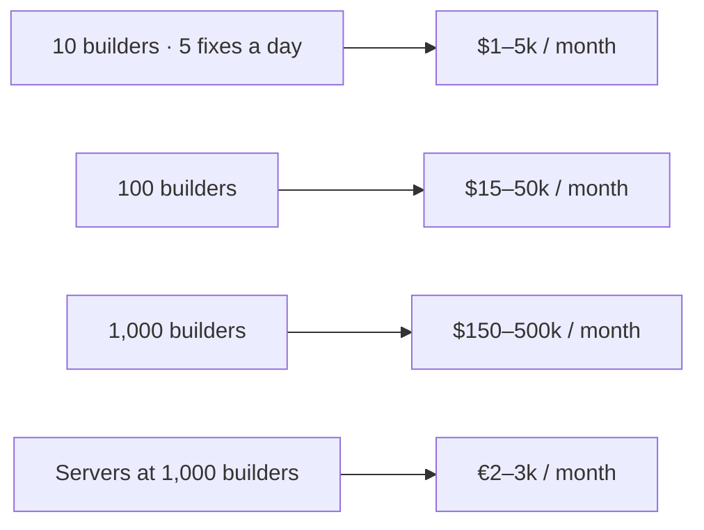

Everything the studio ships runs on one server: a Hetzner CX43 with eight cores and sixteen gigabytes of memory, about seventeen euros a month. It hosts the OrangeCat app, Loki, Solon, the database, the agent that builds fixes, and fifteen client sites. This morning a visitor's feedback on a pet-care site became a pull request, merged, deployed and was walked through on the live page, and every step of that happened on that one machine.

The question we get asked, and ask ourselves, is whether this scales. To one partner building a café website in their hometown, to a hundred, to every builder who would rather direct work than do it by hand. The honest answer is that it scales in stages, each stage has a wall, and the walls arrive in a fixed order. This post is that order.

## The unit of scale is a builder

Loki's queue already knows how to share. Each agent job is a row in Postgres that one runner claims with a lock nobody else can take. Runners on ten boxes could drain that queue tomorrow without a change to the queue. What does not exist yet is the thing that lets a stranger's work run beside ours: a tenant.

Today the cloud builder is one Linux user with one set of credentials. That is not a capacity limit, it is a correctness limit. A second builder on the same runner could read the first builder's files and spend the first builder's API keys. So the first wall is not "how many", it is "who", and it is fixable with software alone: one system user, one clone root, one runner process and one credential file per approved account.

## The six walls

| Wall | Hit at | What it is | What fixes it |
| --- | --- | --- | --- |
| Tenancy | 1 builder | One runner, one user, shared keys | Per-account isolation on the box |
| One box | 5–10 active builders | A CX43 runs 3–5 agent sessions at once | Runners on several boxes claiming from one queue |
| Machines | 50–100 builders | Compute has to be bought | More Hetzner, €1–3 per builder per month |
| Everything not ours | 100–500 builders | GitHub rate limits, DNS, abuse, data-protection paperwork | Loki as a GitHub App on the builder's org; per-tenant limits; a DPA and an exit path |
| Tokens | Every builder, from day one | The intelligence is paid per token | Bring your own key first, meter second, own the routine inference third |
| Humans | Whenever one reviewer is the gate | Approving partners is a job | Peer review as signed votes in Solon |

Only one line in that table is a cliff. The rest are slopes.

## Machines are cheap; that never changes

A small Next.js site idles at two or three hundred megabytes. An agent session, with its build steps, wants one to two gigabytes and a core or two while it works. A dedicated Hetzner server at sixty euros a month runs ten to fifteen sessions. At a thousand active builders the server bill is two or three thousand euros a month, and the way to pay it is to rent more of the same. Owning hardware for the control plane never pays off, and a data centre is a question for a different decade.

## Tokens are the wall

An agent fix reads the codebase, thinks, edits, runs the checks and writes the pull request. That is somewhere between three hundred thousand and three million tokens, which at today's frontier prices is between fifty cents and ten dollars per fix. The homepage rewrite we shipped this morning sat near the top of that range.

Tokens cost fifty to a hundred times what compute costs. This is the line an investor will ask about, and it is the line we plan around. Three levers, in the order we will pull them:

1. **Bring your own key.** The builder pays their model vendor directly and pays us for the platform. Fleet Runner already works this way. The margin is safe; the setup friction is real.
2. **Meter it.** Buy tokens wholesale on our accounts and sell them inside a plan, the way Cat Credits already price frontier models at provider cost plus forty percent. This is the first point where we float money, and cash flow starts to matter.
3. **Own the routine inference.** Reviews, walkthrough scripts, the widget's second opinions and the daily briefs do not need a frontier model. Once monthly API spend passes roughly thirty thousand dollars, a rented GPU running an open-weight coding model makes that half of the work three to five times cheaper. That is the point at which "should we run our own models" becomes the right question. Our own hardware only enters the picture above about a million dollars a year of steady inference.

GPUs do not solve the wall. They change the slope of the line once there is enough volume to fill them.

## The human wall

The partner track we are building has one gate: build one real thing, show it, get approved. Right now one person does the approving. Ten applications a week is a job; a hundred is a bottleneck no server can buy down.

This is why Solon is not a side project. Who becomes a partner, what a partner is owed, and what counts as shipped are decisions members can sign. And the money side, a partner paid for a café site, a café owner funding the work, is what OrangeCat's payment rails exist for. The three products were split by audience for exactly this: Loki is private to the builder, Solon is shared with members, OrangeCat is public.

Someone who is not approved loses nothing that matters. The whole stack is public, the records that describe it are in the repositories, and the last lesson of the academy we are writing is how to run it yourself.

## What we do now, and when we raise

Software first, in this order: per-tenant isolation, runners on more than one box, bring-your-own-key as the default with token use recorded per run, the partner application flow, Loki as a GitHub App. None of it needs investment.

Money only when a metric says so. More boxes when the queue's median wait is minutes and the box is over seventy percent memory. Wholesale tokens when a third of would-be builders stop at "add your API key". Rented GPUs when API spend passes thirty thousand a month and most of it is routine work.

Raising is for the moment the token line, not the server line, is what stops us serving demand: a visible queue, a positive margin per builder, and a falling cost per shipped fix. That slide has no ambiguity in it.

The rocket is a pool of cheap boxes and a queue that already shares. The fuel is tokens. Everything before buying fuel wholesale is engineering, and it is engineering we can do this month.
